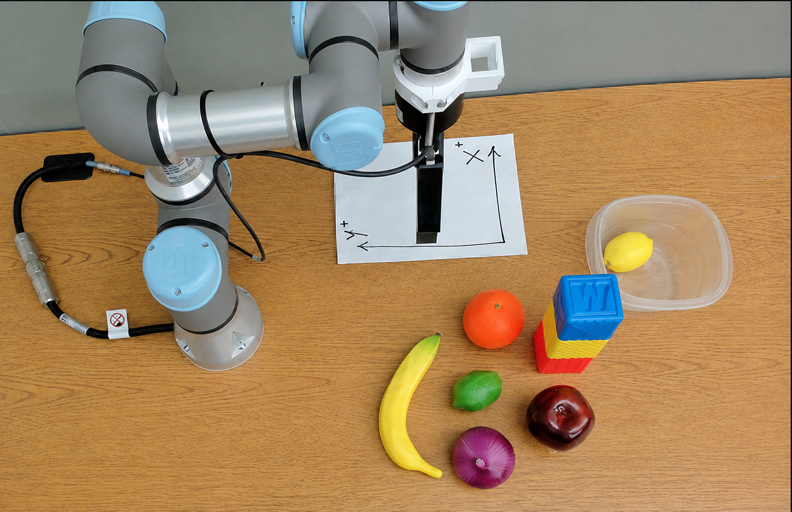
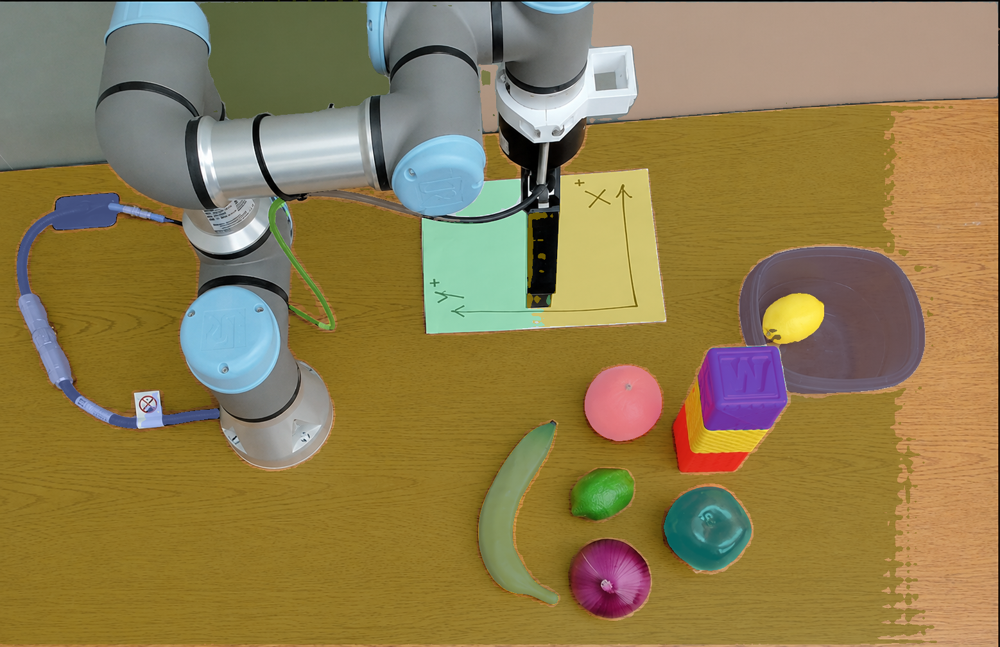
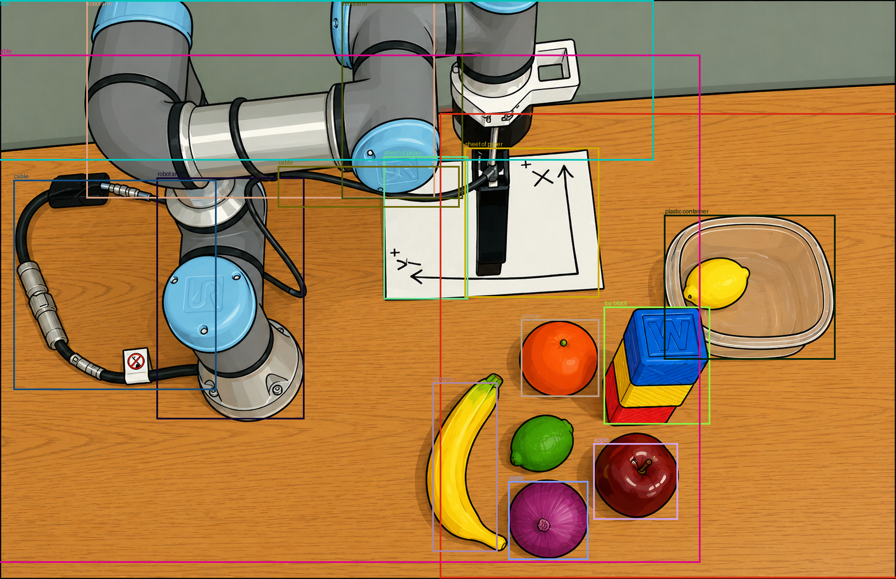
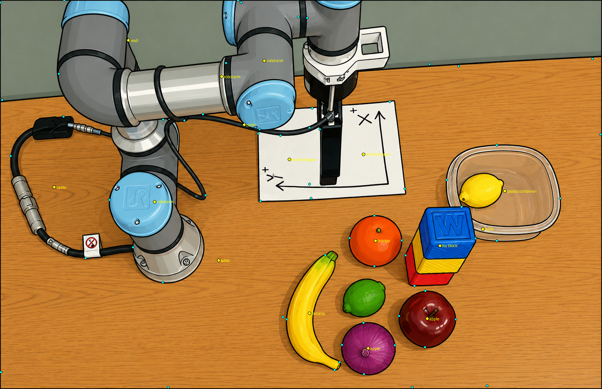
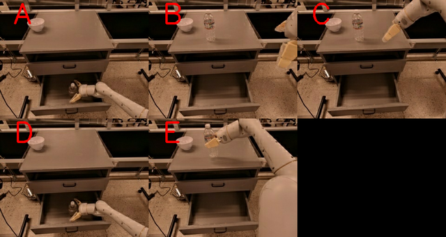
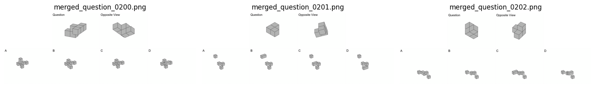
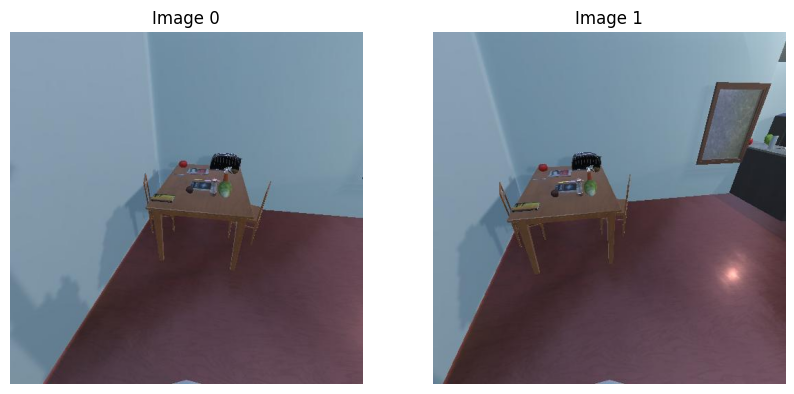
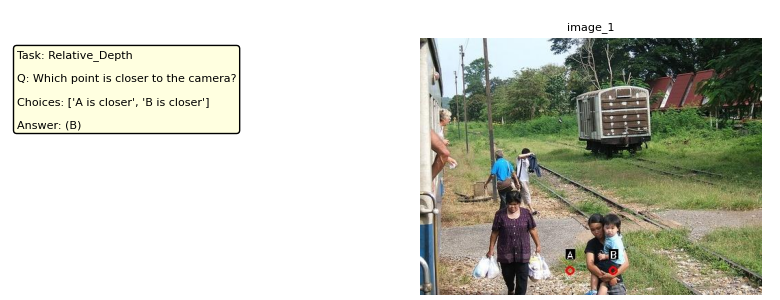

# Multimodal_Datasets_Generative_Reasoning

This repository provides a **minimal, data-centric reference** for building, extending, and analyzing datasets for generative reasoning in multimodal large language models (MLLMs).

## Purpose

The goal is not to introduce a new benchmark, but to **operationalize common dataset construction patterns** observed across recent literature—including synthetic generation, automatic annotation, curation, and evaluation—especially for spatial and visual reasoning tasks.

## What’s Inside

* **examples/from_scratch/**: build a VQA dataset from a raw image — segmentation, bounding boxes, keypoints, then Q&A generation
* **examples/extend_existing/**: notebooks that load, inspect, and visualize existing spatial/VQA benchmarks (Robo2VLM-1, SPATIAL-DISE, SAT, BLINK, VSI-Bench, 3DSRBench)
* **notebooks/**: exploratory analysis, prompt iteration, and dataset quality inspection
  * `04_coco_vqa_spatial_dataset.ipynb`: end-to-end example transforming COCO images + annotations into a spatial VQA dataset via programmatic spatial facts and LLM-assisted question–answer generation
* **prompts/**: reusable LLM prompt templates for VQA generation, spatial relations, and quality checks
* **survey/**: companion survey notes on datasets, benchmarks, tasks taxonomy, and open gaps
* **qwen25vl_3dsrbench_lora/**, **qwen25vl_3dsrbench_grpo/**: SFT + GRPO fine-tuning of Qwen2.5-VL-3B on 3DSRBench, with adapters and result plots

## Examples

### Building a VQA dataset from scratch

[`examples/from_scratch/robot_scene/`](examples/from_scratch/robot_scene/) — starting from one raw image, run open-vocabulary segmentation (OWLv2 + SAM), draw boxes, and extract keypoints, producing the annotations a VQA-generation step consumes next.

| Original | Segmented | Bounding boxes | Keypoints |
|:---:|:---:|:---:|:---:|
|  |  |  |  |

### Extending existing datasets

[`examples/extend_existing/`](examples/extend_existing/) — notebooks that load, inspect, and visualize established spatial/visual-reasoning benchmarks, as a starting point for extending them with new questions or annotations.

| Dataset | Sample |
|---|:---:|
| **[Robo2VLM-1](examples/extend_existing/1_Robo2VLM/Robo2VLM_open.ipynb)** — VQA from in-the-wild robot manipulation trajectories |  |
| **[SPATIAL-DISE](examples/extend_existing/2_SPATIAL_DISE/SPATIAL-DISE_open.ipynb)** — unified benchmark for spatial reasoning in VLMs |  |
| **[SAT](examples/extend_existing/3_SAT/SAT_open.ipynb)** — spatial aptitude training on static & dynamic scenes |  |
| **[BLINK](examples/extend_existing/BLINK/BLINK.ipynb)** — fine-grained visual perception across 14 tasks (depth, correspondence, counting, ...) |  |
| **[VSI-Bench](examples/extend_existing/VSI-Bench/VSI_Bench.ipynb)** — visual-spatial intelligence from egocentric video | *(notebook only, no exported sample image)* |
| **[3DSRBench](examples/extend_existing/4_3DSRBech/)** — 3D spatial reasoning; also used below for fine-tuning | see results ↓ |

### Fine-tuning on 3DSRBench

[`qwen25vl_3dsrbench_lora/`](qwen25vl_3dsrbench_lora/) + [`qwen25vl_3dsrbench_grpo/`](qwen25vl_3dsrbench_grpo/) — Qwen2.5-VL-3B fine-tuned in two stages (QLoRA SFT, then GRPO reinforcement learning); full method and configs in [`examples/extend_existing/4_3DSRBech/README.md`](examples/extend_existing/4_3DSRBech/README.md).

| Stage | Accuracy |
|---|---|
| Base model | 55.5% |
| After SFT | 78.0% |
| After GRPO | 90.0% |

## Scope

This repo serves as a **companion artifact** to a survey on datasets and benchmarks for multimodal reasoning. It is intentionally modular, lightweight, and model-agnostic, designed to help researchers translate survey insights into reproducible dataset pipelines.

## Intended Use

* Building datasets from scratch (synthetic or simulated)
* Curating or extending existing multimodal datasets
* Prototyping spatial or reasoning-focused VQA data

This repository is educational and illustrative by design, emphasizing clarity and reproducibility over scale.
